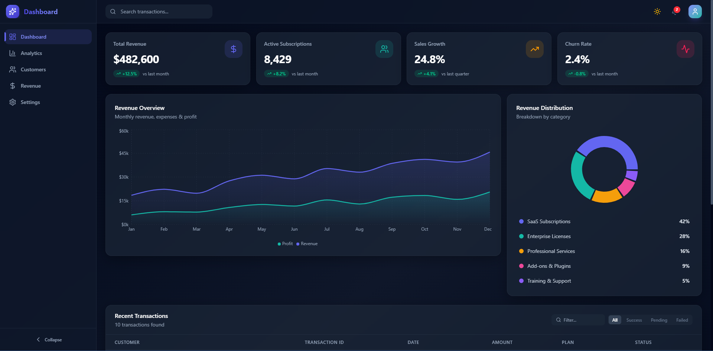
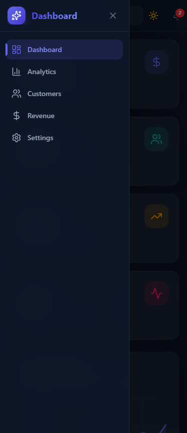
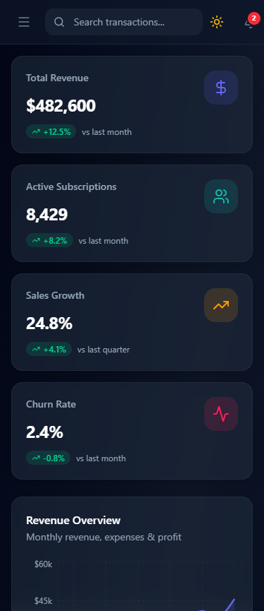

# 🚀 Modern SaaS Analytics Dashboard

[](https://react.dev/)
[](https://vitejs.dev/)
[](https://tailwindcss.com/)
[](https://opensource.org/licenses/MIT)
[](#)

A high-performance, premium SaaS Analytics Dashboard UI designed for modern web applications. Focuses on exceptional UX, smooth transitions, and data-driven layouts.

> [!IMPORTANT]
> **This is an Open-Source Front-End UI/UX implementation.**
> There is no backend or database integrated. All data is handled via local **mock files** to simulate a real-world API experience and ensure fast, offline-capable demonstration.

---

## 📸 Screenshots

### 🖥️ Desktop View



### 📱 Tablet & Mobile

<div align="center">
  
  
</div>

---

## ✨ Key Features

- **🌗 Dynamic Theme System**: Full Dark/Light mode support with smooth transitions, persisted via local storage.
- **📊 Interactive Analytics**: Beautiful, responsive data visualization using Recharts (Revenue trends, Subscription distribution).
- **🔍 Advanced Filtering**: Live search and status-based filtering for transaction tables.
- **⚡ Performance First**: Lightning-fast page transitions and skeleton loaders for an "App-like" feel.
- **📱 Responsive Navigation**: Collapsible sidebar for desktop and a sleek mobile-drawer menu.
- **🎬 Micro-Animations**: Professional UI feedback and entrance animations powered by Framer Motion.
- **🧩 Modern Tech Stack**: Built with React 19, Vite, and the latest Tailwind CSS 4.

---

## 🛠️ Tech Stack

| Category       | Technology                                                   |
| :------------- | :----------------------------------------------------------- |
| **Framework**  | [React 19](https://react.dev/) + [Vite](https://vitejs.dev/) |
| **Styling**    | [Tailwind CSS 4](https://tailwindcss.com/)                   |
| **Animations** | [Framer Motion](https://www.framer.com/motion/)              |
| **Charts**     | [Recharts](https://recharts.org/)                            |
| **Icons**      | [Lucide React](https://lucide.dev/)                          |
| **Routing**    | [React Router 7](https://reactrouter.com/)                   |

---

## 📂 Project Structure

```ascii
SaaSDashboard/
├── public/              # Static assets
├── src/
│   ├── assets/          # Images and global SVGs
│   ├── components/      # Reusable UI components
│   │   ├── Sidebar.jsx
│   │   ├── TopBar.jsx
│   │   ├── RevenueChart.jsx
│   │   └── ...
│   ├── context/         # State Management (Theme, Filters)
│   ├── data/            # Mock API data files
│   ├── pages/           # Page containers (Dashboard, Settings, etc.)
│   ├── App.jsx          # Main application routing & layout
│   ├── main.jsx         # Entry point
│   └── index.css        # Tailwind directives & global styles
├── index.html
├── package.json
└── vite.config.js
```

---

## 🚀 Getting Started

### Prerequisites

- [Node.js](https://nodejs.org/) (v18 or higher recommended)
- npm or yarn

### Installation

1. **Clone the repository:**
   ```bash
   git clone https://github.com/Muradov2004/SaaSDashboard.git
   ```
2. **Navigate to the project directory:**
   ```bash
   cd SaaSDashboard
   ```
3. **Install dependencies:**
   ```bash
   npm install
   ```
4. **Start the development server:**
   ```bash
   npm run dev
   ```

The application will be available at `http://localhost:5173`.

---

## 🤝 Contributing

Contributions are welcome! If you have suggestions for new features or improvements, feel free to fork the repo and create a pull request or open an issue.

1. Fork the Project
2. Create your Feature Branch (`git checkout -b feature/AmazingFeature`)
3. Commit your Changes (`git commit -m 'Add some AmazingFeature'`)
4. Push to the Branch (`git push origin feature/AmazingFeature`)
5. Open a Pull Request

---

## 📄 License

Distributed under the MIT License. See `LICENSE` for more information.

---

## 👤 Credits

Developed with ❤️ by **Ali Muradov**

---
